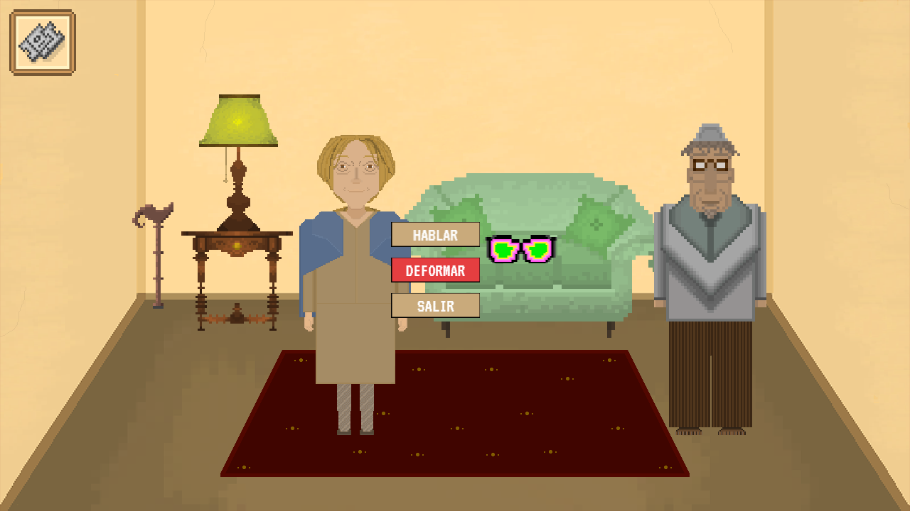
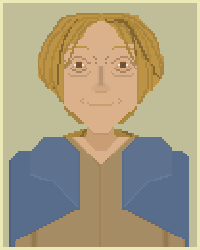
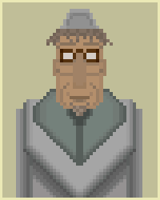

# **BLINDLESS**

## Integrantes de MASA:
* Adrián Migueles D'Ambrosio
* Alberto Gómez Castaño
* Mario Miguel Cuartero
* Simeón Konstantinov Petrov

## [WEB](https://albgom21.github.io/BlindLess-PVLI-20-21/)
## [PIVOTAL](https://www.pivotaltracker.com/n/projects/2469517)
## ARQUITECTURA UML
 .

| **Géneros:** Novela Interactiva | **Modos:** Solitario |
| --- | --- |
| **Público objetivo:** Dirigido a personas de entre 10 a 50 años | **Plataformas:** Página Web |

## LOGO

**Capturas de juego** 

# Aspectos generales

BlindLess es un juego basado en el libro &quot;Luces de bohemia&quot; del autor de la generación del 98, Ramón María del Valle-Inclán. En este aparecerán los lugares más relevantes mencionados en la obra, al igual que sus personajes.

El juego trata de ir avanzando en la historia pudiendo elegir distintos caminos con diferentes finales con las decisiones que tome el jugador.

# Menú 
En el menú del mapa se pueden visualizar los distintos caminos que se tomarán según las decisiones del jugador. A la derecha se muestra una breve descripción de la próxima escena, incluyendo el nombre de esta, los puntos de vida posibles a ganar/perder y la vida actual de Max.  
La escena a la que se vaya a pasar aparecerá con el icono resaltado en el mapa.

## Interfaz y control 

_**(Interfaz del juego)**_

La forma con la que se interactúa con el mundo mediante clics del ratón. Esto le permite al jugador interaccionar con objetos y personajes, con los que podrá mantener conversaciones y tener el poder de decidir por dónde quiere que vaya la historia.  
Para avanzar en los diálogos se puede hacer con clics pero también pulsando espacio.  
En cuanto al minijuego, los controles serán A (moverse hacia la izquierda), W (saltar) y D (moverse hacia la derecha).

# Jugabilidad
## Mecánica

### DEFORMACIONES

La deformación es una mecánica que otorga al jugador la oportunidad de poder deformar su realidad, es decir, la capacidad de obtener nuevas pistas y recompensas, o castigos e inconvenientes durante el trayecto.

Entre las deformaciones se puede encontrar:

- Recibir diálogo/acciones de objetos.

### VIDA

A medida que el jugador vaya interactuando con el entorno y tomando decisiones, estas tendrán consecuencias. Una de las consecuencias será que la vida del jugador puede decrementar si, al accionar un NPC u objeto y deformarlo, Max Estrella se crea una imagen mental dañina para él.

### LOTERÍA

El jugador podrá comprar lotería en los bares u obtenerla en alguna de las escenas. Se restarán puntos de vida a Max al comprar un boleto.

### INVENTARIO

El inventario contendrá el número de coleccionables recogidos actualmente más los boletos de lotería que se posean. Para acceder a él, se clicará un botón colocado en la parte superior izquierda de la pantalla.
    
## Dinámica

La dinámica principal del juego es avanzar en la escena que te encuentras e ir decidiendo por que camino de la historia prefieres ir avanzando mediante las diferentes decisiones que te da a elegir.

El poder de decisión lo tiene el jugador, es decir, dependiendo de las opciones que elija a la hora de interactuar con el mapa del camino escogido, la historia irá avanzando por este. Una dinámica puede ser recrear la narrativa del libro, escogiendo las opciones correspondientes a la historia real o por el contrario elegir la opción que más se adecue a la manera de pensar del jugador.

Otra dinámica incluida es el sistema de lotería. El jugador descubrirá al final de la partida si alguno de los boletos de lotería que ha comprado anteriormente han sido premiados.

## Estética

### AMBIENTACIÓN Y GRÁFICOS

La estética del juego se basará en un estilo 2D en 8bits de los lugares típicos de Madrid en la década de 1920, al igual que el ambiente de la obra. 
Los colores, para ser más característicos de la obra, serán colores apagados y con abundancia de tonalidades marrones y amarillas. También aparecen tonos azulados, pues la obra transcurre en una noche. 

### EXPERIENCIA DE JUEGO

El jugador será capaz de ponerse en la piel de Max Estrella, el protagonista, y revivir la obra de _Luces de bohemia_tomando parte y acción en ella.

Las decisiones que tome el jugador serán vitales para el transcurso del juego, pues limitarán sus posibilidades y abrirán, a su vez, de nuevas. Así, la toma de decisiones es un foco vital en _BlindLess_, y la experiencia que obtendrá el jugador se verá también enriquecida al verse envuelto en el mundo que creó Ramón María del Valle-Inclán en su obra.
 Asimismo, tendrá que andar con ojo mientras juega, ya que podrá obtener los diferentes coleccionables que se encuentran esparcidos por las escenas del juego, y, si consigue recogerlos todos, aportarán satisfacción al jugador que haya conseguido completar el juego al 100%. Por otra parte, el que no lo haya conseguido, sentirá frustración y querrá volver a jugar para poder pasarse el juego y finalizarlo.

# Contenido

## Narrativa

### PERSONAJES

Max Estrella: el protagonista de la historia. Un escritor bohemio que se ha quedado ciego y está en la miseria. El jugador tomará este papel y avanzará en la historia de la misma manera en que lo hace Max Estrella en la obra.

Don Latino: es un anciano asmático que vende mala literatura y, se arrima a Max. Es la parte negativa de la obra, y puede ser visto como el antagonista.

Madame Collet: La mujer de Max y madre de su única hija.

Claudinita: Hija de Max Estrella y Madame Collet.

Don Gay Peregrino: Hombre flaco, alto y moreno, según la descripción de Ramon María del Valle-Inclán. Intercambia de posición su nombre.

La Pisa Bien: Joven de baja clase social, que representa la sociedad marginal madrileña de la época.

La Lunares: Es una prostituta, joven y honesta, incluso inocente.

La Vieja Pintada: Es una prostituta en sus últimos años. Descarada y desvergonzada.

### RESUMEN DE ESCENAS

**Escena 1: (ESCENARIO: Buhardilla de la casa de Max)**

Se presenta a Max, su mujer(Madame Collet), su hija(Claudinita), y a Don Latino, se ve que es una familia sin recursos económicos, incluso pensando en el suicidio colectivo, Max es un escritor cuyas novelas parecen no tener éxito, Don Latino consigue un mal trato por ellas y apenas saca dinero para poder alimentar a su familia. El borracho de Don Latino le hace salir en busca de una mejor oferta por sus libros.

**Escena 2.1: (ESCENARIO: Librería de Zaratustra)**

Van para reclamar más dinero por sus libros. Pero el librero no quiere revertir el trato y engaña a Max, debido a su ceguera, indicando que ya los ha vendido cuando, en realidad, están en la trastienda. Don Latino ve lo que el librero hace y le sigue la corriente, por lo que entendemos que, en realidad, Latino también se está aprovechando del ciego. (Jugar con el hecho de que hay animales y latino le traiciona).Don Gay Peregrino, vuelve de Londres, gritos de &quot;Viva España&quot; en el exterior,conversación sobre la situación del país y las diferencias que hay con Inglaterra.

**Escena 2.2: (ESCENARIO: Calle)**

Maxse encuentra con Don Gay Peregrino el cual vuelve de Londres y se escuchan gritos de &quot;Viva España&quot; ,conversación sobre la situación del país y las diferencias que hay con Inglaterra. Le invita a ir pero este le dice que no ya que va de camino a ver a su amigo Zaratustra a la librería.

**Escena 3: (ESCENARIO: taberna Pica Lagartos)**

Max y Don Latino se emborrachan y empiezan a hablar con diferentes personas características del Madrid de la época.

La Pisa Bien le reclama el precio del décimo que no ha pagado y que se quiere quedar al ser capicúa, quiere pagarlo con su capa (más frío-\&gt;bajar vida si se elige pagarlo)

Fuera de la taberna hay disputas entre distintas personas que reflejan la inestabilidad político social que se vivía en la España de entonces.

**Escena 4.1.1: (ESCENARIO: buñolería)**

Max y Don Latino van para poder comprar el décimo (en la obra La Pisa Bien se va antes de que Max se lo pueda comprar). Allí Max habla con distintos poetas modernistas que le conocen y hablan sobre su situación.

Don Latino corta la conversación con una canción montando jaleo, todos borrachos. Viene la policía y Max vacila al capitán y lo lleva al Ministerio de la Gobernación.

**Escena 4.1.2: (ESCENARIO: Ministerio de la Gobernación)**

Max tiene que declarar sobre lo ocurrido y su actitud irónica lo llevará a los calabozos.

**Escena 4.2: (ESCENARIO: Ministerio de la Gobernación)**

Max se le ocurre la idea de ir al ministerio para pedir una ayuda por su discapacidad, vuelve a casa para decir que no y habla con el gobernante que le da la opción de tener una paga.

**Escena 5: (ESCENARIO: calabozo)**

Max se encuentra con un obrero catalán con el que empieza a hablar y descubre que tienen muchas ideas en común. El catalán es muy consciente del futuro que le espera: disparos por la espalda por un supuesto &quot;intento de fuga&quot;. Al final, un policía vendrá a por Mateo y Max se quedará llorando de rabia e impotencia en la celda.

**Escena 5 (Opción 4.2): (ESCENARIO: Casa)**

Madam Collet le recuerda que el gobernante era amigo suyo y que insista en pedir ayuda a su amigo.

**Escena 6: (ESCENARIO:Ministerio de la Gobernación)**

Max reclama por el trato que se le ha dado(en general, no del calabozo) y consigue hablar con el gobernante: Paco, un viejo amigo que accede a darle un sueldo mensual de la cuenta pública que los gobernantes usan para sus gastos(corrupción, elegir si lo acepta o no).

**Escena 7: (ESCENARIO: Calle, Paseo del Prado)**

Don Latino y Max se encuentran en una zona donde abundaba la prostitución y donde dos prostitutas intentarán convencerles para tener clientes aquella noche. Don Latino se irá con una de ellas pero Max, se quedará con la Lunares, hablando sobre diferentes aspectos de su vida personal pero, también, sobre la vida de ella.

**Escena 8: (ESCENARIO: Calle)**

Don Latino y Max se encuentran con una revuelta

Se encuentran a una mujer llorando porque han matado a su hijo de un tiro. Ha tenido lugar una batalla entre la policía y los obreros que ha terminado con esta absurda muerte.

Max está horrorizado ante esta situación y el llanto desconsolado de la madre (se le resta vida). Pero, entonces, se oye de lejos el ruido de un fusilamiento y el protagonista tiene la certeza de que esos disparos están siendo lanzados sobre la espalda de su amigo del calabozo.

**Escena 9: (ESCENARIO: Puerta de la casa de Max)**

Max se sienta y comienza a pronunciar un monólogo con el que termina realizando toda una proeza literaria: define el concepto de esperpento.

Comenzará a sentir un frío intenso y se irá desvaneciendo. Don Latino intentará llamar a su mujer pero no llega a tiempo: Max muere rígido de frío y bebido. Don Latino, al ver el cuerpo de su amigo, decidirá quitarle la cartera con el pretexto de que, así, nadie se la robará. (Quitar 10 puntos de vida y decidir la escena 10 según esté vivo o no)

**Escena 10 (muerto): (ESCENARIO: taberna Pica Lagartos)**

Don Latino, borracho, está fingiendo que siente un gran pesar por la muerte de Max. En esta escena se darán cuenta de que el premio del décimo comprado por Max, finalmente, tocó y que es Don Latino quién está disfrutando de él. Así que todos los miembros del bar intentarán sacar tajada del premio con falsas cuentas pendientes que tenían con el fallecido.

Empiezan a discutir pero, al final, la disputa se cerrará con el anuncio de la muerte de una mujer y una niña. Se sabrá que son la hija y la esposa de Max que, finalmente, se han suicidado. (Dar el resultado de la lotería, añadir un texto referenciando el resultado)

**Escena 10 (vivo): (ESCENARIO: taberna Pica Lagartos)**

Varios personajes aparecen en la taberna celebrando que se ha repartido el número ganador de la lotería.

(Dar el resultado de la lotería, añadir un texto referenciando el resultado)

# Primeros minutos de juego

Al empezar el juego, el jugador verá una pantalla de inicio que le indique que haga clic para empezar a jugar.
La primera escena, mostrará una escena en casa de Max en la que se verán los muebles de su casa, junto con su mujer. El jugador podrá posicionar el cursor sobre los objetos y personajes que sean interactuables, y clicar sobre ellos para abordar una interacción. Partimos las interacciones - si el jugador clica sobre:

El _BOTÓN DE INVENTARIO_, aparecerá en pantalla el inventario actual de Max Estrella, conteniendo 0 coleccionables y 1 boleto de lotería. 

 

El _BASTÓN_, se añadirá 1 al total de coleccionables recogidos, que podrá verse en el inventario.

Las _GAFAS_, tendrá la opción de hablar con ellas, y de deformarlas. Si decide deformarlas, su apariencia cambiará y al volver a hablar con ellas herirán a Max.

 

_MADAME COLLET_, tendrá la opción de hablar con ella, lo cual iniciará el primer diálogo principal del juego. Al acabar dicho diálogo, aparecerá DON LATINO.

 

_DON LATINO_, se seguirá el diálogo principal y al terminarlo, aparecerá el BOTÓN DE PASE DE ESCENA, el cual, si es clicado, procederá a pasar de escena.

 

# Referencias

Libro: Luces de bohemia

Mapa: Slay the Spire

Menú: Gods Will Be Watching

Point and Click: Swords and Sandals 4: Tavern Quests

# Comunicación

La comunicación se ha establecido mediante la plataforma Discord, con varios canales para el arte o cosas de carácter general.

# Gestión

La gestión del proyecto se ha hecho mediante la plataforma Pivotal Tracker, con dailies semanales para repartir el trabajo de cada miembro cada semana, siguiendo la metodología ágil de Scrum.
